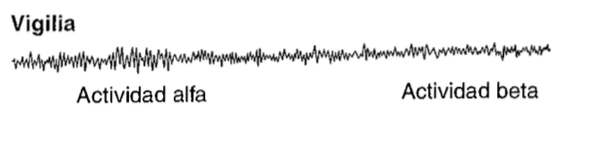
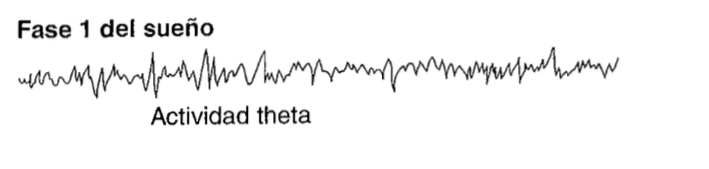
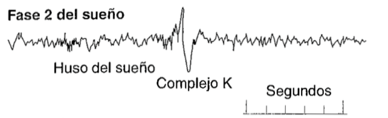
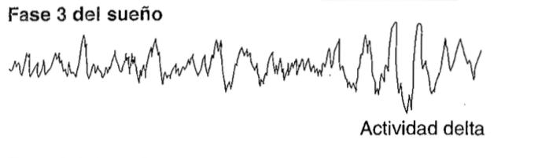
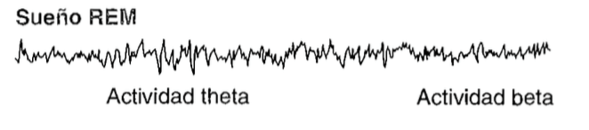
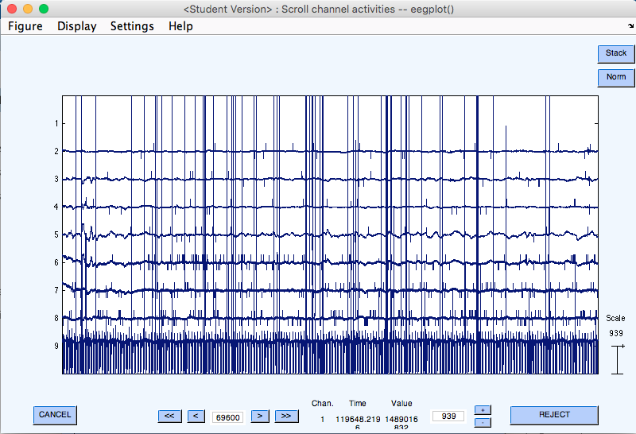
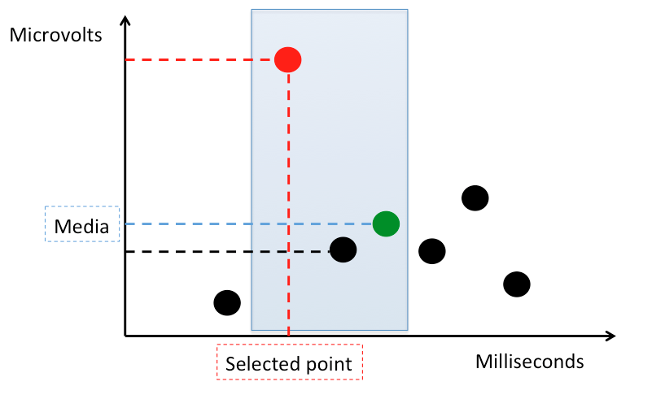
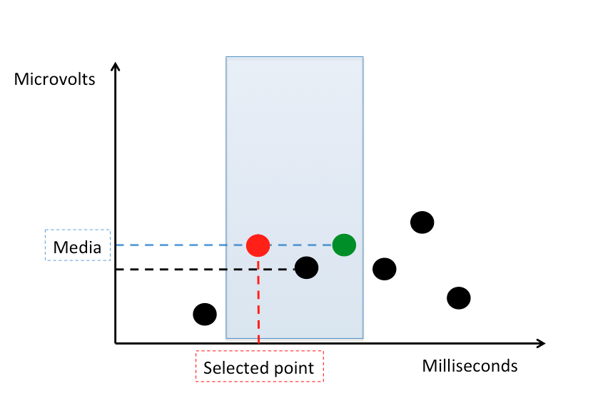

# Sleep Data

## The Data
Data was collected with a Traumschreiber, a high-tech sleep mask for research purposes developed by Johannes and Kristoffer.

## The Data 

- 5 data sets corresponding to different nights of sleep
- Electroencephalogram (EEG) data: Measures microvolts with respect to time
- 7 EEG channels and one Electrocardiogram (ECG) channel
- About 7 hours of sleep per set are recorded
- Data is labeled by epochs of one second
- One second contains about 200 values

## Sleep phases and frequency bands

- The data is labeled according to the sleep stages introduced by the American Academy of Sleep Medicine (AASM)
- These differentiate five main stages:
	- Wakefulness
	- Non-Rapid Eye Movement (NREM) 1,2 and 3
	- Rapid Eye Movement (REM) stage

## Wakefulness

- Active wakefulness with open eyes with Beta wave (+13 Hz)
- Relaxed wakefulness with closed eyes with mostly alpha wave (8-13 Hz)

{ width=67%}

@carlson2002fisiología

## Stage NREM-1 

Very light, easily disrupted sleep. Dominated by Theta activity (4-7 Hz). It is the transition between wakefulness and sleep. One may be aware of outside stimulus like noises.

{ width=67%}

@carlson2002fisiología

## Stage NREM-2

First unequivocal stage of sleep. Characterized by Theta waves, sleep spindles and K-complexes.

{ width=67%}

@carlson2002fisiología

## Stage NREM-3

Dominated by Delta wave (0.5-2 Hz) along with some sleep spindles, although much fewer than NREM-2. It is the most relaxing stage, were one is unaware of any sounds or other stimuli. 

{ width=67%}

@carlson2002fisiología

## Stage R (REM) 
Characterized by low-amplitude mixed-frequency brain waves. Theta, alpha and even beta activity can be observed. Waves are sharp-pointed.
OEG records of eye movements. The person in this stage is sensitive to the noise or movements around and may wake up at any time. 

{ width=67%}

@carlson2002fisiología

## Next steps with the data

Conclusion about our data:

- The signal varies in frequencies during time

Goal: 

- To find a proper method for identifying and extracting the different frequencies in the data in order to do feature extraction

## Filtering the Data

## Median Filter

The main idea of the median filter is to run through the signal entry by entry, replacing each entry with the median of neighboring entries. 

~~~~
filtered_data = scipy.signal.medfilt(signal, kernel_size=3)
~~~~

## Median Filter

{ width=50%}
{ width=50%}

