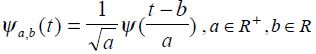
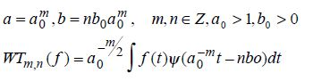

# Discrete Wavelet Decomposition

## Wavelet Transform

###Definition
* A wavelet is a waveform of effectively limited duration that has an average value of zero
* Useful for accurately analyse of non-stationary signals( signals that have time varying frequency)

## Wavelet Transform
###Key Concepts 
 

## Wavelet Transform

* The continuous wavelet transform can be computed by shifting the chosen scale of the wavelt in time, multiplying by the signal, and integrating over all times.
* CWT is a correlation between a wavelet at different scales and the signal with the scale being used as a measure of similarity.

## Wavelet Transform

* In the case of the discrete wavelet transform, the mother wavelet is shifted and scaled by powers of 2.

* a0=2, b0=1 is the usal choice

## Wavelet Decomposition

* The procedure starts with passing this signal through a half band lowpass filter with impulse response h[n] and half band highs pass filter with impulse response g[n]

$${\displaystyle y_{\mathrm {low} }[n]=\sum \limits _{k=-\infty }^{\infty }{x[k]g[2n-k]}}$$

$${\displaystyle y_{\mathrm {high}}[n]=\sum \limits _{k=-\infty }^{\infty }{x[k]h[2n-k]}}$$

## Wavelet Decomposition

* Nyquist's sampling rate is the minimum sampling rate that allows the original continuous signal to be reconstructed from its discrete samples.

* Sampling rate must be at least twice greater then the highest frequency component

* The decomposition halves the time resolution since only half the number of samples now characterizes the entire signal.

* It doubles the frequency resolution, since the frequency band of the signal now spans only half the previous frequency band.

## Wavelet Decomposition -EEG Signal

.png )

## Wavelet Decomposition -EEG Signal
* The frequencies that are most prominent in the original signal will appear as high amplitudes in that region of the DWT signal that includes those particular frequencies.

* Time localization will have a resolution that depends on which level they appear.

## Wavelet Decomposition -EEG Signal
.png )

## Wavelet Decomposition-Time And Frequency Resolutions
* This procedure in effect offers a good time resolution at high frequencies, and good frequency resolution at low frequencies

