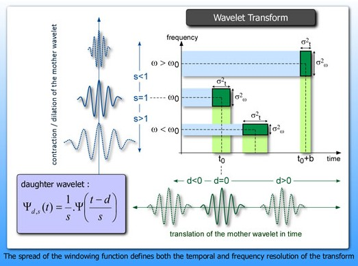
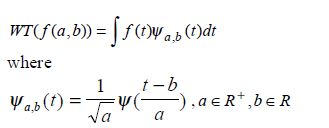
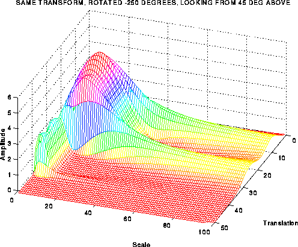
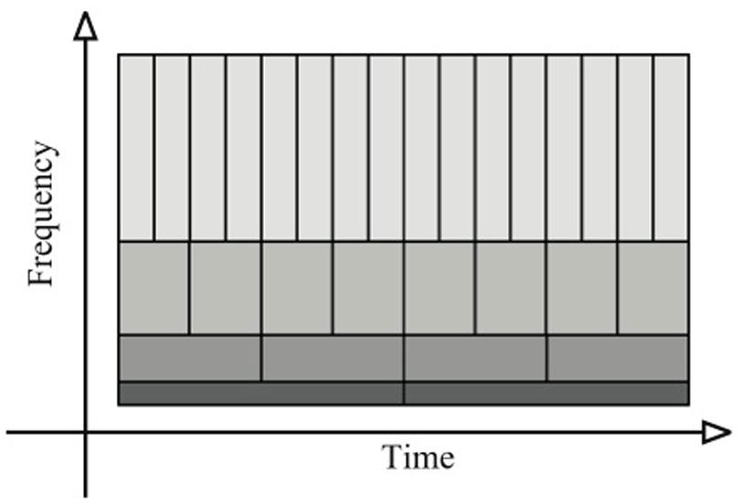

# Discrete Wavelet Decomposition

## Wavelet Transform

###Definition
* A wavelet is a waveform of effectively limited duration that has an average value of zero
* Useful for accurate analysis of non-stationary signals ( signals that have time varying frequency)

## Wavelet Transform
###Key Concepts 
 

## Wavelet Transform
* CWT is a convolution between a wavelet at different scales and the signal with the scale being used as a measure of similarity.

* In the case of the discrete wavelet transform, the mother wavelet is shifted and scaled by powers of 2.

## Wavelet Transform

## Wavelet Discrete Decomposition

* Nyquist's sampling rate is the minimum sampling rate that allows the original continuous signal to be reconstructed from its discrete samples.

* Sampling rate must be at least twice greater then the highest frequency component

* A half band lowpass filter removes all frequencies that are above half of the highest frequency in the signal

## Wavelet Decomposition-Time And Frequency Resolutions
* This procedure in effect offers a good time resolution at high frequencies, and good frequency resolution at low frequencies

## Wavelet Decomposition -EEG Signal

.png )

## Wavelet Decomposition -EEG Signal

* The frequencies that are most prominent in the original signal will appear as high amplitudes in that region of the DWT signal that includes those particular frequencies.

* Time localization will have a resolution that depends on which level they appear.

