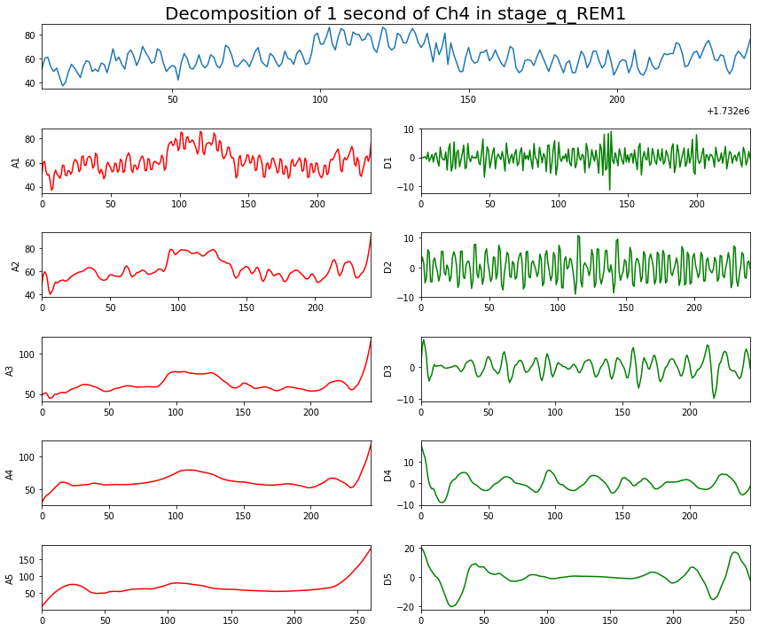
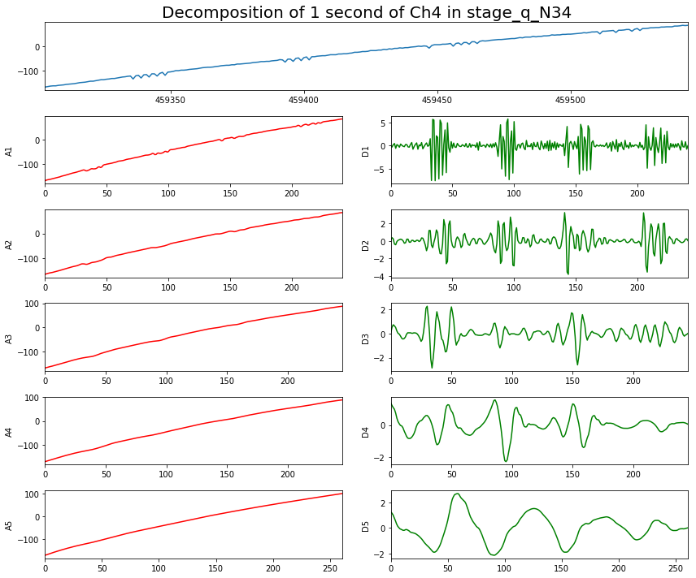

## DWT applied on REM

## DWT applied on deep sleep

## Energy

- Features are the energy of different frequency bands
- 5 freqency bands for each of the 8 channels = 40 features

- Energy is the squared norm of the coefficients

~~~~
def Energy(coeffs, k):
    return np.sqrt(np.sum(np.array(coeffs[-k]) ** 2)) / len(coeffs[-k])
~~~~

<!-- $$ \displaystyle E_{l}\ \ =\ \  \frac{\sqrt{\sum_{k=1}^{N_{K_{l}}} \ K_{l}(k)^2}}{N} $$ -->

