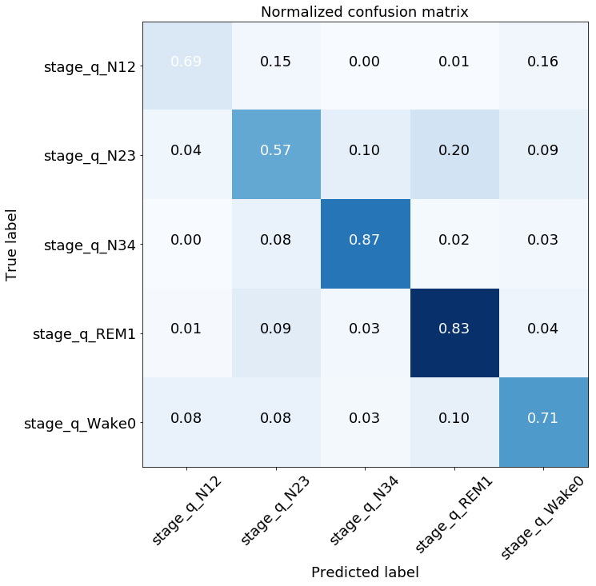
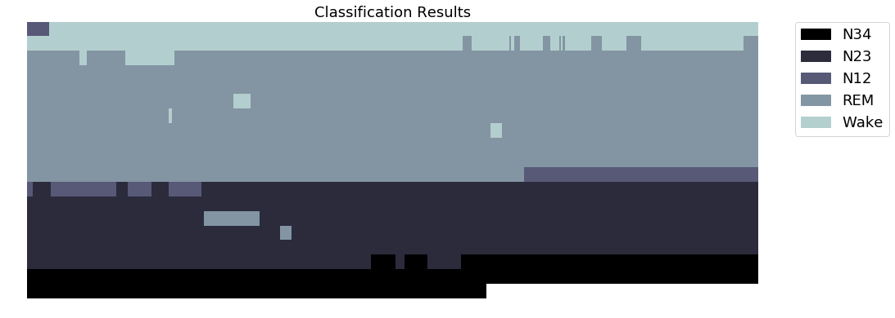

# Classifiers
## Performance of the Random Forest Classifier
- Assessed with crossvalidation, Score: 0.923

## Hyperparameter Search Random Forest

- Randomized Hyperparameter Search for Bootstrapping, splitting criterion, depth of trees, features to be considered for split and number of trees
- 20 random parameter sets are tried out with cross validation

## The best Forest Parameters

| Model |  Bootstrap | Criterion | Depth  | Features for split | N Trees | Score           |
| ----- | ---------- | --------- | :-----:| :-----------------:| :------ | :-------------- |
| 1     | False      |  Entropy  | None   |  21                |    73   |0.919 $\pm$ 0.003|
| 2     | False      |  Entropy  | None   |  16                |    25   |0.919 $\pm$ 0.004|
| 3     | False      |  Entropy  | None   |  14                |    25   |0.918 $\pm$ 0.002|

## The worst Forest Parameters

| Model |  Bootstrap | Criterion | Depth  | Features for split | N Trees | Score           |
| ----- | ---------- | --------- | :-----:| :-----------------:| :------ | :-------------- |
| 18    | True       |  Entropy  | 3      |  37               |    53   |0.498 $\pm$ 0.039|
| 19    | False      |  Entropy  | 3      |  38               |    25   |0.453 $\pm$ 0.020|
| 20    | False      |  Entropy  | 3      |  38               |    48   |0.441 $\pm$ 0.028|

-> Classifiers with unrestricted depth and less features for split perform better

## AdaBoost in Scikit learn

- Scikit learn uses as algorithm SAMME/SAMME.R
- SAMME : Stagewise Additive Modeling using a Multi-class Exponential loss function (@freund1997decision),
- puts more weight on misclassified data points than AdaBoost you know
- SAMME.R (R for real) uses weighted probability esitimates to update the additive model (empirical vs. population loss)

## Performance of the AdaBoost Classifier
- Assessed with crossvalidation, Score:  0.745

## The best AdaBoost Parameters

| Model |  N Trees  |Tree Depth| Algorithm |  Score           |
| ----- | ----------| -------- | --------- |  :-------------- |
| 1     | 188       |   3      | SAMME.R   | 0.810 $\pm$ 0.006|
| 2     | 151       |    3     |  SAMME.R  | 0.797 $\pm$ 0.003|
| 3     | 128       |    3     |  SAMME.R  | 0.791 $\pm$ 0.002|

## The worst AdaBoost Parameters

| Model  |  N Trees |Tree Depth | Algorithm |  Score           |
| ------ | ---------| --------  | --------- |  :-------------- |
| 18     | 106      |   1       | SAMME     | 0.570 $\pm$ 0.002|
| 19     | 82       |   1       |   SAMME   | 0.559 $\pm$ 0.001|
| 20     | 77       |   1       |  SAMME    | 0.465 $\pm$ 0.006|

-> Classifiers with more trees, depth and SAMME.R performs better

## Random Forest performance on the test set

## AdaBoost performance on the test set

## Classification results visualized

- Only for one subject
- Using Random Forest Classifier, Score: 0.945

## An idea to improve the predictions

- Smoothing  wrong prediction in the middle of the sleep phase 
- A little improvement, Score: 0.959

