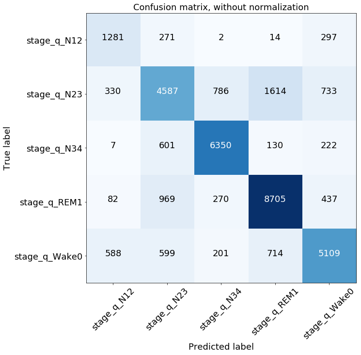
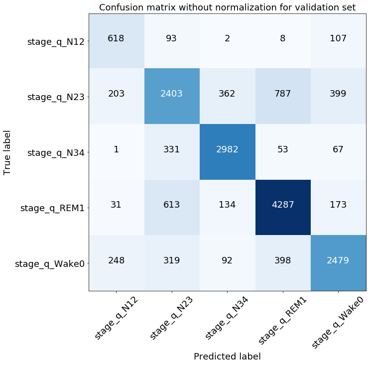

# Random Forest
## Performance
- Assessed with crossvalidation

## Hyperparameter Search Random Forest

- Randomized Hyperparameter Search for Bootstrapping, splitting criterion, depth of trees, features to be considered for split and number of trees
- 20 random parameter sets are tried out with cross validation

## The best Forest Parameters

| Model |  Bootstrap | Criterion | Depth  | Features for split | N Trees | Score           |
| ----- | ---------- | --------- | :-----:| :-----------------:| :------ | :-------------- |
| 1     | True       |  Entropy  | None   |  10                |    61   |0.920 $\pm$ 0.001|
| 2     | False      |  Entropy  | None   |  21                |    70   |0.919 $\pm$ 0.002|
| 3     | True       |  Entropy  | None   |  9                 |    35   |0.918 $\pm$ 0.003|

## The worst Forest Parameters

| Model |  Bootstrap | Criterion | Depth  | Features for split | N Trees | Score           |
| ----- | ---------- | --------- | :-----:| :-----------------:| :------ | :-------------- |
| 18    | True       |  Entropy  | 3      |  31                |    73   |0.541 $\pm$ 0.021|
| 19    | True       |  Gini     | 3      |  34                |    37   |0.525 $\pm$ 0.003|
| 20    | False      |  Entropy  | 3      |  30                |    91   |0.504 $\pm$ 0.028|

-> Depth matters

# AdaBoost

## Performance
- Assessed with crossvalidation

## The best AdaBoost Parameters

| Model |  N Trees | Algorithm |  Score           |
| ----- | ---------| --------- |  :-------------- |
| 1     | 81       |  SAMME.R | 0.620 $\pm$ 0.006|
| 2     | 78       |  SAMME.R  | 0.620 $\pm$ 0.005|
| 3     | 98       |  SAMME.R | 0.620 $\pm$ 0.007|

## The worst AdaBoost Parameters

| Model  |  N Trees | Algorithm |  Score           |
| ------ | ---------| --------- |  :-------------- |
| 18     | 34       |  SAMME    | 0.511 $\pm$ 0.025|
| 19     | 28       |  SAMME    | 0.506 $\pm$ 0.021|
| 20     | 18       |  SAMME    | 0.465 $\pm$ 0.024|

-> SAMME.R performs better

# Comparison on validation data

## Random Forest performance

## AdaBoost performance

